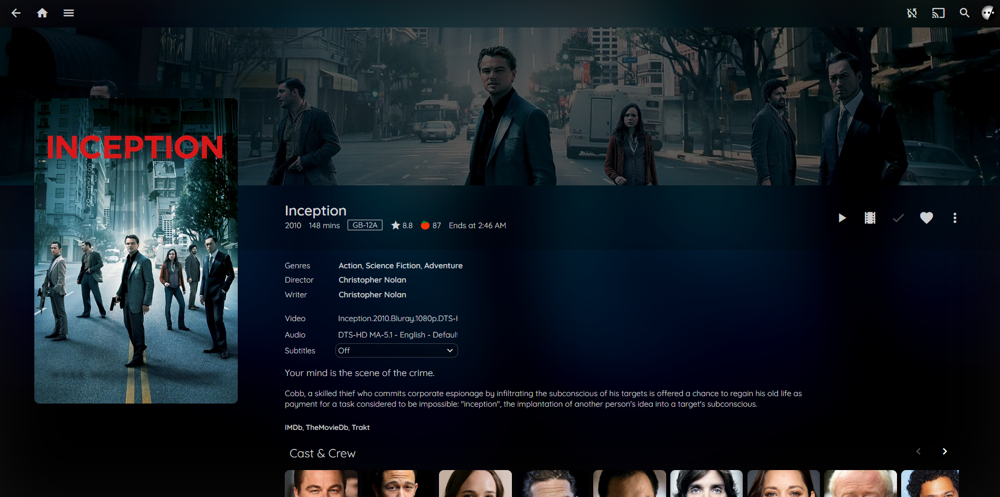

# Monochromic - deprecated
### Superseded by the new [Ultrachromic](https://github.com/CTalvio/Ultrachromic) theme

A custom theme for Jellyfin mediaserver created using CSS overrides. Note that I maintain this theme to be compatible with whatever version of Jellyfin I am currently using. Which is usually the latest stable release. You can therefore assume that using the theme on older versions may not work, but also that if a new release breaks something, that I will fix it. If you encounter unthemed elements or something broken, open an issue.

Check out my other theme, [Kaleidochromic](https://github.com/CTalvio/Kaleidochromic), if you are looking for something more colorful, or [Novachromic](https://github.com/CTalvio/Novachromic) if you are a full on light mode kind of person.

To use the theme copy paste the line below into "Dashboard>General>Custom CSS" and click save, it will apply immediately server-wide to all users on top of any theme they may be using. To remove the theme, clear the "Custom CSS" field and then click save. **NOTE: Theme may not work when using reverse proxy**, check the bottom section of this readme for more info.


```css
@import url('https://ctalvio.github.io/Monochromic/default_style.css');
```


## Features
- Themes **EVERYTHING**
- Dark, Transparent, Minimalistic
- Uses the same font as the JF logo everywhere
- Add-ons for an easy personal touch
- Customizable accent color
- Blurred backdrops
- Squared aesthetic with rounded corners (optionally corners so sharp you might get an eye poked out)
- Two options for progress bars
- Works well on mobile
- More compact
- Smaller and squared cast info

## Add-ons

This theme has some additional options, they can allow the use of a custom accent color, and more. These are added immediately after the default import line.


### Alternate itempage

A different itempage to the default of the theme, more reminiscient of "vanilla" as it does not remove the backdrop banner.

```css
@import url('https://ctalvio.github.io/Monochromic/alternate-itempage_style.css');
```



### Improve performance

The theme uses mask-image to fade out items below the top bar as you scroll. This works well on most reasonable hardware but struggles on some phones and especially smart TVs. This switches to a method without using mask-image, but foregoes the fade-out effect. I may switch to this method being the default.

```css
@import url('https://ctalvio.github.io/Monochromic/improve-performance_style.css');
```

### Accent color presets 

Blue restores some of the default jellyfin blue accenting, while purple uses... Well, purple, in a Jellyfin shade of course.

```css
@import url('https://ctalvio.github.io/Monochromic/jfblue_style.css');

@import url('https://ctalvio.github.io/Monochromic/jfpurple_style.css');
```

### Restore bottom bar style episode progress

Don't like my transparent view progress overlay? Use this to go back to the old style.

```css
@import url('https://ctalvio.github.io/Monochromic/bottom-progress_style.css');
```

### Backdrop on mobile for 10.7.0

This add-on turns the cover image on the mobile item page into a backdrop, since mobile on 10.7.0 has no backdrop for library items on mobile.

```css
@import url('https://ctalvio.github.io/Monochromic/backdrop-hack_style.css');
```

### Define your own accent color

This now uses a single RGB value in a variable. This lets me use the color at various transparencies and hence apply the accent more flexibly in places. Use any RGB color picker to find the value for any given color and enter it. **This import line and variable should always be last**.
```css
@import url('https://ctalvio.github.io/Monochromic/customcolor-advanced_style.css');
:root {--accent: R, G, B;}
```

### Modify rounding

By adding this variable at the bottom, after the import lines, the rounding can be removed, reduced or increased. **Variables should always be last**.
```css
:root {--rounding: 5px;}
```

## Screenshots


## Using with reverse proxy

When using the Nginx Reverse proxy config from the [Jellyfin docs](https://jellyfin.org/docs/general/networking/nginx.html) the theme will not work by default. (If you are using the subpath config, you can ignore all this.)

Because the config includes Content-Security-Policy which reduces risk of XSS, you need to add the URL from this repo and the fonts to the list of allowed external sources.

In the nginx config you should change the

```
add_header Content-Security-Policy ....
```
to:

```
add_header Content-Security-Policy "default-src https: data: blob:; style-src 'self' 'unsafe-inline' https://ctalvio.github.io/Monochromic/default_style.css https://ctalvio.github.io/Monochromic/jfblue_style.css https://ctalvio.github.io/Monochromic/jfpurple_style.css https://ctalvio.github.io/Monochromic/bottom-progress_style.css https://ctalvio.github.io/Monochromic/customcolor-advanced_style.css https://ctalvio.github.io/Monochromic/improve-performance_style.css https://fonts.googleapis.com/css2; script-src 'self' 'unsafe-inline' https://www.gstatic.com/cv/js/sender/v1/cast_sender.js worker-src 'self' blob:; connect-src 'self'; object-src 'none'; frame-ancestors 'self'";
```

If you don't do this the theme will simply not load (reverts back to default theme) and the browser console will spit out an error. Even if you paste in all the CSS, the font will still not load since it is loaded from an external source.

Thanks to [LickABrick](https://github.com/LickABrick) for discovering this, and submitting instructions on how to fix.
